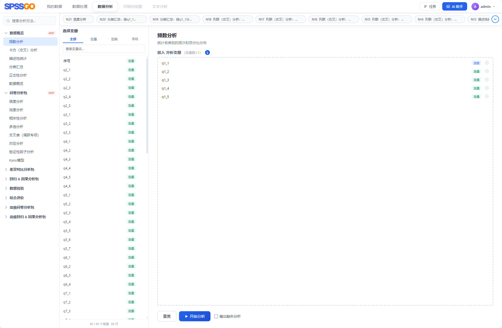
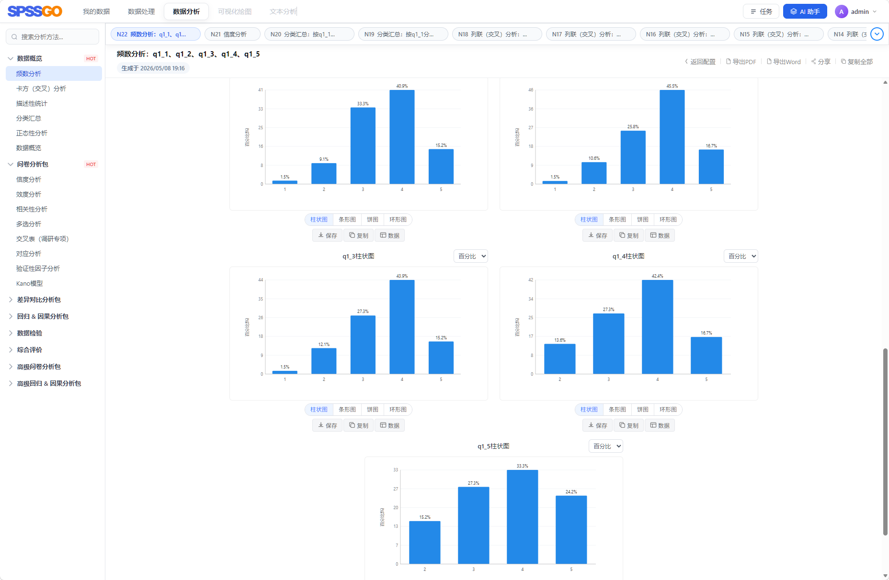
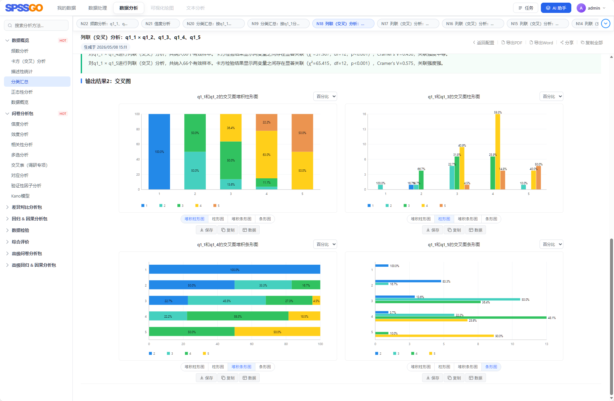
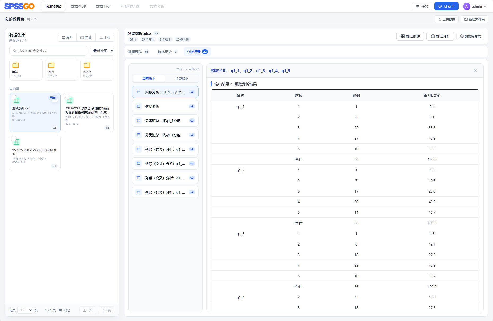
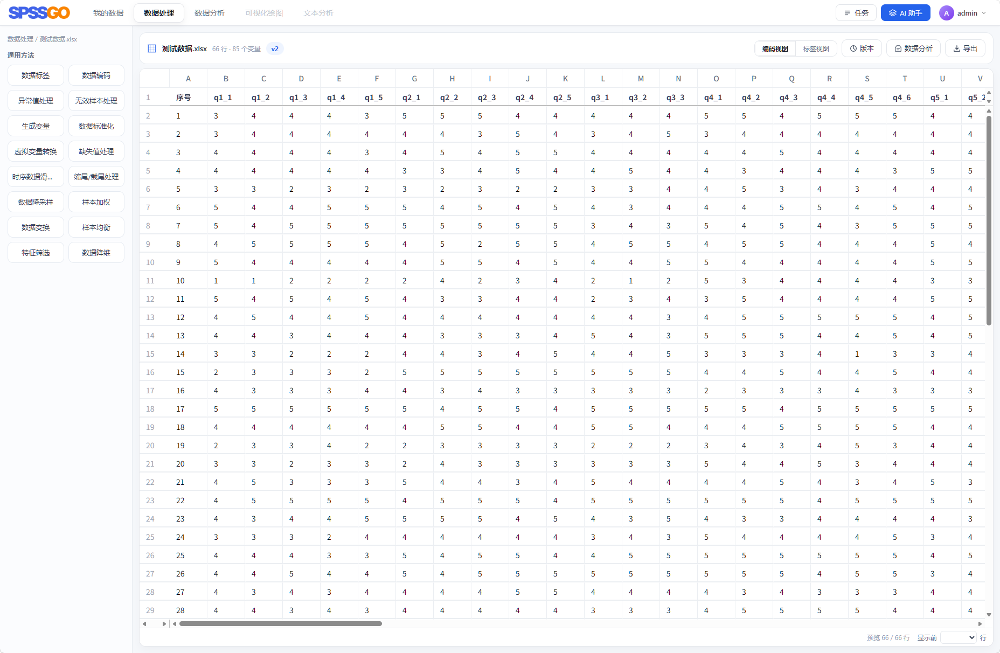
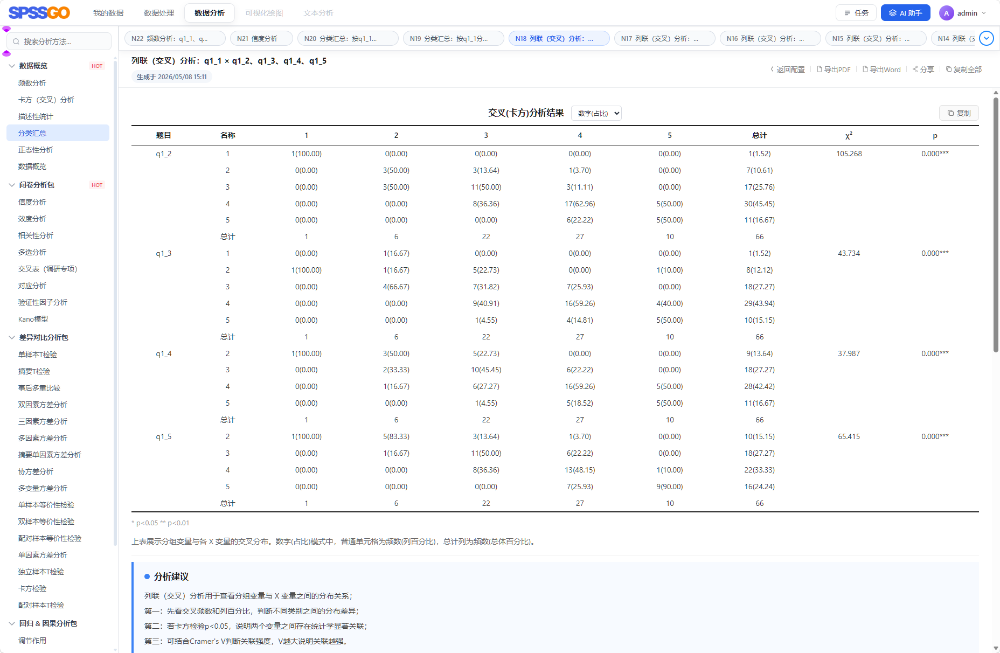

# SPSSGO

AI 驱动的在线数据分析平台。导入数据、处理变量、选择分析方法，一键出结果和报告。

体验网址：[http://wj.maxform.top/](http://wj.maxform.top/)

## 快速开始

```powershell
# 1. 安装依赖
pip install -r requirements.txt
cd frontend && npm install && cd ..

# 2. 配置环境变量（复制 .env.example 为 .env 并修改）
cp .env.example .env

# 3. 初始化数据库
alembic upgrade head

# 4. 启动后端
uvicorn backend.app:app --host 127.0.0.1 --port 8000

# 5. 启动前端（新终端）
cd frontend && npm run dev
```

前端默认 `http://localhost:5173`，后端 `http://127.0.0.1:8000`，接口文档 `http://127.0.0.1:8000/docs`。

Windows 本地开发默认不启用后端热重载，避免 `uvicorn --reload` 的 reloader 异常刷满 `.tmp/*.log`。需要自动重启时设置 `BACKEND_RELOAD=1` 后使用 `start-backend.bat`，脚本只监听 `backend/` 下的 Python 文件，并会在启动前轮转超过 10MB 的后端临时错误日志。

Docker Compose 一键部署：

```powershell
docker compose up -d
```

Docker 镜像会自动安装 `Rscript`、`jsonlite` 和 `lavaan`，使用 Docker 部署时不需要在宿主机额外安装 R；只有本地直接运行后端时才需要手动安装。

非 Docker 部署时，信度、EFA、CFA、SEM、路径/中介等方法还需要额外安装 R：

```bash
sudo apt-get update && sudo apt-get install -y r-base
Rscript -e "install.packages(c('jsonlite','lavaan'), repos='https://cloud.r-project.org')"
```

## 能做什么

### 数据导入
支持 Excel(.xlsx/.xls)、CSV、SPSS(.sav/.zsav)、Stata(.dta)、SAS(.sas7bdat/.xpt)、JSON、Parquet、问卷(.docx/.doc)。

### 数据处理（15+ 种）
标签、编码、缺失值、异常值、标准化、虚拟变量、滑窗转换、缩尾、降采样、加权、数学变换、样本均衡、特征筛选、PCA 降维、新变量生成。

### 统计分析（80+ 种方法）

| 类别 | 方法 |
|------|------|
| 描述与基础 | 频数、描述统计、数据探查、交叉表 |
| 差异检验 | t 检验、单/双/三/N 因素方差分析、MANOVA、ANCOVA、Mann-Whitney、Kruskal-Wallis、Wilcoxon、Friedman |
| 相关与回归 | Pearson/Spearman 相关、多元回归、VIF、中介/调节/路径分析 |
| 因子与结构方程 | EFA、CFA、SEM、信度分析 |
| 问卷方法 | KANO、MaxDiff、联合分析、TURF、NPS、BPTo、价格断点 |
| 综合评价 | AHP、TOPSIS、VIKOR、CRITIC、熵权法、灰色关联、RSR、耦合协调、DEA、模糊综合评价、ISM |

完整参数说明见 [docs/ANALYSIS_METHOD_PARAMS.md](docs/ANALYSIS_METHOD_PARAMS.md)。

### R 增强分析
信度分析、EFA、CFA、SEM、路径分析、中介效应等高级方法走 R 引擎，R 不可用时明确报错不降级。Docker 镜像已内置 `Rscript`、`jsonlite` 和 `lavaan`；非 Docker 部署时需要在服务器手动安装。R 脚本位于 [backend/r_scripts/](backend/r_scripts/)。

### AI 辅助
接入 DeepSeek，支持 AI 生成分析计划、自动化任务编排、结果解读。

### 报告导出
分析结果导出 Word 报告，支持公开分享链接。

## 界面预览

| 工作台概览 | 数据面板 |
|:---:|:---:|
|  |  |

| 分析配置 | 分析结果 |
|:---:|:---:|
|  |  |

| 可视化图表 | 报告导出 |
|:---:|:---:|
|  |  |

## 项目结构

```text
SPSSGO/
├── backend/          后端（FastAPI）
│   ├── routes/       API 路由
│   ├── services/     业务服务
│   ├── repositories/ 数据访问
│   ├── analysis/     80+ 分析方法
│   ├── processing/   数据处理
│   └── r_scripts/    R 增强脚本
├── frontend/         前端（Vue 3 + Vite）
│   └── src/
│       ├── views/        页面
│       ├── components/   业务组件
│       ├── composables/  组合式逻辑
│       └── entries/      多入口
├── alembic/          数据库迁移
├── tests/            测试用例
├── docs/             文档
└── compose.yaml      Docker 部署编排
```

## 技术栈

| 层级 | 技术 |
|------|------|
| 后端 | Python 3.11 + FastAPI |
| 前端 | Vue 3 + Vite |
| 数据库 | MySQL 8.4 + SQLAlchemy + Alembic |
| 异步 | Redis + Celery |
| 统计 | pandas / scipy / statsmodels / pingouin / sklearn + R |
| AI | DeepSeek API |
| 部署 | Docker + Docker Compose |

## 开发者

黄霸道 · QQ群：978402915

## 参与贡献

- 提交 Issue 反馈问题与建议
- 贡献代码（前端、后端、分析方法、R 脚本）
- 完善文档与案例

## License

AGPL-3.0
